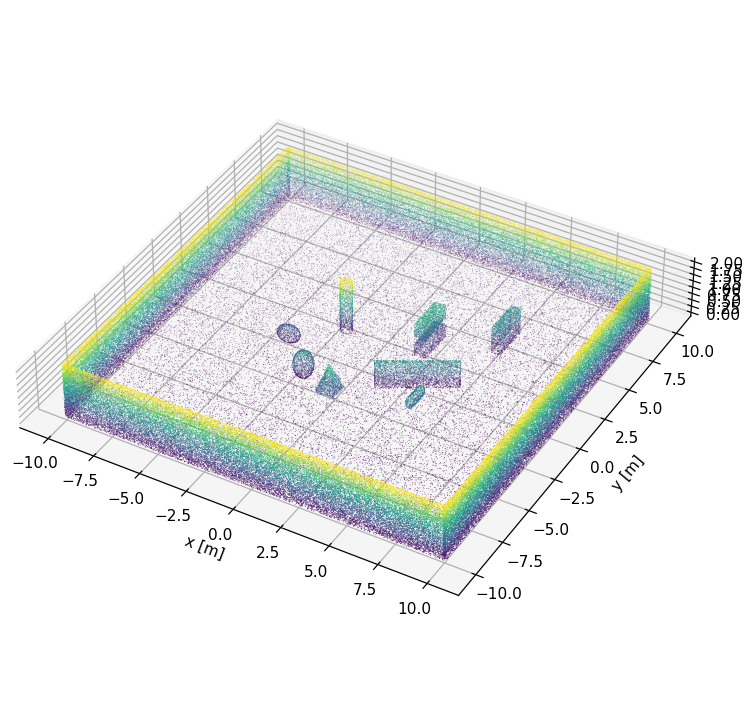
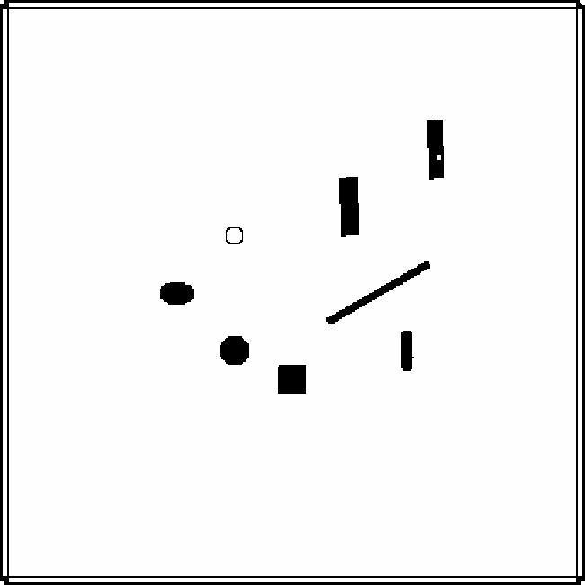
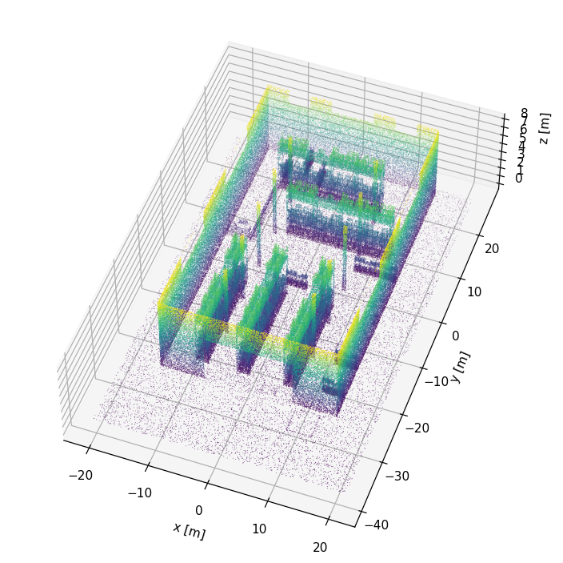
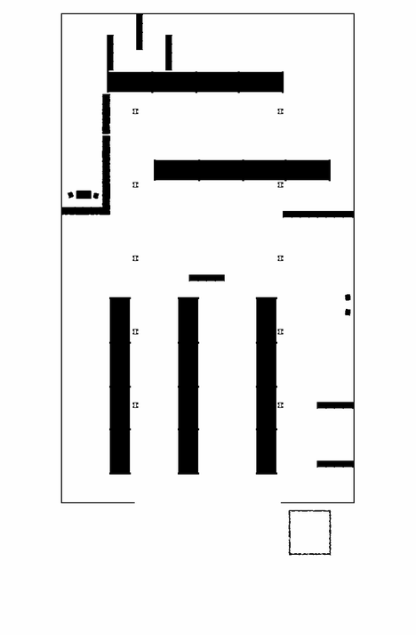

# sdf2map

[](https://github.com/atinfinity/sdf2map/actions/workflows/ci.yml)

*[日本語版 README はこちら](README.ja.md)*

An offline converter that reads Gazebo (Harmonic) SDF world files and
generates 3D point cloud maps (PCD) for NDT localization and 2D occupancy
grid maps (PGM + YAML) for Nav2. Built for ROS 2 Jazzy.

Instead of launching Gazebo, sdf2map parses the world with libsdformat14
and samples every geometry surface at a uniform density. The resulting
maps have distance-independent point density and no occlusion holes,
which keeps NDT voxel statistics well conditioned. NDT usability is
guarded by an automated registration test, and was confirmed on a real
warehouse world (9.5 mm position error from a 0.5 m / 8.6° initial
offset).

## Supported geometry

- box / cylinder / sphere / capsule / ellipsoid / cone / plane
- polyline (extruded polygon; concave outlines handled via ear clipping)
- mesh (DAE / OBJ / STL through the gz-common MeshManager; `<scale>` and
  `<submesh>` supported)
- heightmap (grayscale images, slope-corrected uniform surface sampling;
  DEM / GeoTIFF not supported yet)
- `<include>`, nested models, `//pose[@relative_to]` and `<frame>` are
  resolved with libsdformat's SemanticPose

`model://` URIs are resolved through `--model-path`,
`GZ_SIM_RESOURCE_PATH` (and related environment variables), then the
Fuel cache (`~/.gz/fuel`). Missing Fuel models are downloaded
automatically (disable with `--no-download`).

Actors (`<actor>` animated entities) are **intentionally ignored**: they
are dynamic objects and do not belong in a static localization map. A
note is printed when a world contains actors.

## Build

```bash
cd ~/dev_ws
colcon build --packages-select sdf2map
source install/setup.bash
```

## Usage

```bash
ros2 run sdf2map sdf2map \
  --input warehouse.sdf \
  --output map.pcd \
  --voxel 0.05 \
  --occupancy-grid map.yaml
```

### Options

| Option | Default | Description |
|---|---|---|
| `--density <n>` | 400 | surface sampling density [points/m²] |
| `--geometry <collision\|visual>` | collision | which geometry to sample |
| `--voxel <m>` | 0 (off) | VoxelGrid leaf size for the PCD output |
| `--z-min` / `--z-max <m>` | unlimited | height crop for the PCD output |
| `--exclude-ground` | off | skip plane geometries (ground) |
| `--exclude <regex>` | none | skip models by name (repeatable) |
| `--transparency-threshold <t>` | 0.95 | skip visuals with transparency ≥ t in visual mode |
| `--model-path <dirs>` | none | extra `model://` search paths (colon-separated, repeatable) |
| `--no-download` | off | do not download missing Fuel models |
| `--ascii` | off | write ASCII PCD |
| `--seed <n>` | 42 | random seed (output is deterministic) |
| `--publish` | off | publish the cloud on `/sdf2map/map_cloud` (latched) for RViz |
| `--verbose` | off | print resolved world poses per model |

### Occupancy grid options

| Option | Default | Description |
|---|---|---|
| `--occupancy-grid <file.yaml>` | none | also write a Nav2 map (YAML + PGM) |
| `--grid-resolution <m>` | 0.05 | grid cell size |
| `--slice-z-min` / `--slice-z-max <m>` | 0.1 / 1.8 | obstacle height band |
| `--grid-bounds <full\|slice>` | full | grid extent from the full cloud or the obstacle band only |
| `--grid-margin <m>` | 1.0 | margin around slice bounds |
| `--grid-close <n>` | 1 | morphological closing radius for obstacle cells (0 disables) |

The grid marks cells hit by points inside the height band as occupied and
every other in-bounds cell as free (the geometry is fully known, so no
unknown cells are produced). For worlds with a huge ground plane, use
`--grid-bounds slice` to get a compact map around the obstacles.

## Examples

### Bundled test world

`worlds/test_world.sdf` contains every supported primitive, a mesh, a
nested model with `relative_to` frames, and perimeter walls:

```bash
ros2 run sdf2map sdf2map \
  --input worlds/test_world.sdf \
  --output test_map.pcd \
  --occupancy-grid test_map.yaml
```

| Point cloud (PCD) | Occupancy grid (PGM + YAML) |
|---|---|
|  |  |

### Warehouse world

Input: `warehouse.sdf` from
[kachaka_ros2_dev_kit](https://github.com/CyberAgentAILab/kachaka_ros2_dev_kit)
(models fetched from Fuel automatically). The world's Fuel models are
mostly visual-only, so `--geometry visual` is used; `--z-max` crops the
roof and `--exclude` removes the person models:

```bash
ros2 run sdf2map sdf2map \
  --input warehouse.sdf \
  --output warehouse.pcd \
  --geometry visual --z-max 8 \
  --exclude 'Person|MaleVisitor|Casual' \
  --voxel 0.05 \
  --occupancy-grid warehouse.yaml
```

| Point cloud (PCD) | Occupancy grid (PGM + YAML) |
|---|---|
|  |  |

PCL's NDT recovers a simulated sensor pose on this map with 9.5 mm /
0.03° error from a 0.5 m / 8.6° initial offset, and the grid loads
directly in `nav2_map_server`.

## Practical notes

- **Some worlds only have a floor plane as collision** (e.g. the Fuel
  Depot model — its walls and shelves are visual-only). If the map comes
  out empty, use `--geometry visual`, optionally with `--z-max` to crop
  the roof.
- Dynamic objects such as persons can be removed with
  `--exclude 'Person|MaleVisitor'`.
- The output is deterministic for a given `--seed`.

## Tests

```bash
colcon test --packages-select sdf2map && colcon test-result --verbose
```

The suite covers per-geometry samplers, pose-composition regressions,
an end-to-end geometric check of `worlds/test_world.sdf`, occupancy-grid
closing, and an NDT registration check that recovers a known sensor pose
on the generated map. Linters (uncrustify, cpplint, lint_cmake) run as
part of the tests.

## Roadmap

Planned features are complete. Pending decisions and optional future
work are tracked in [docs/ROADMAP.md](docs/ROADMAP.md) (Japanese).

## License

Apache-2.0
